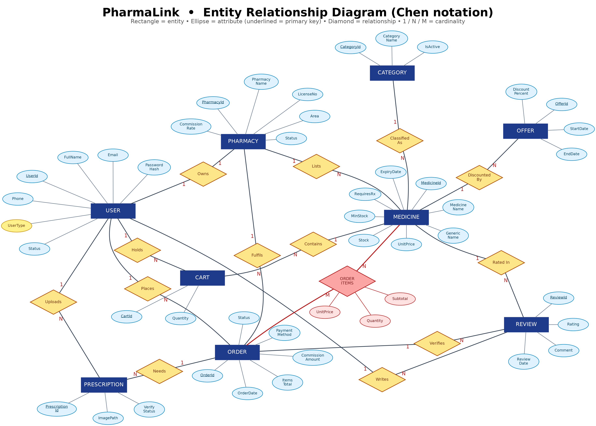
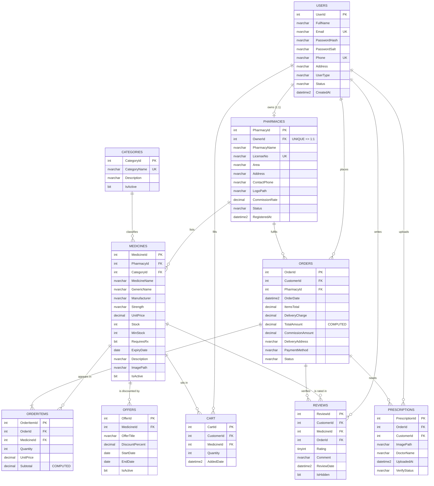
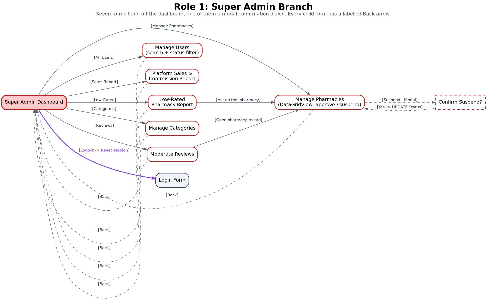
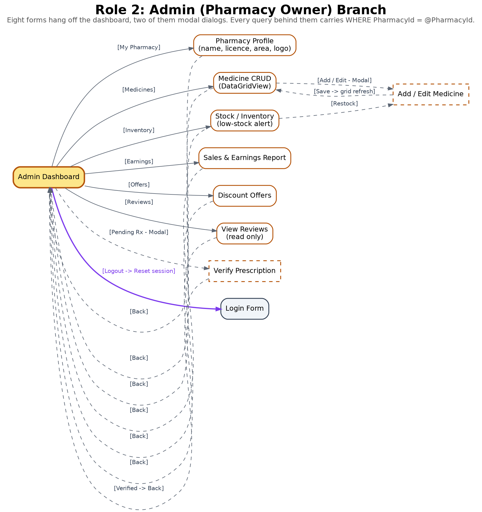
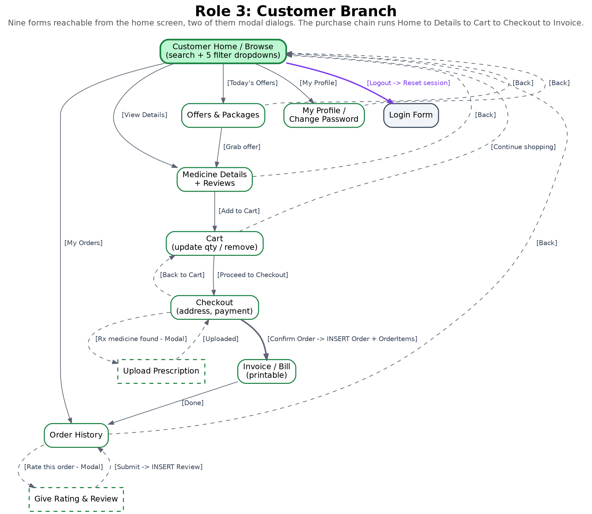
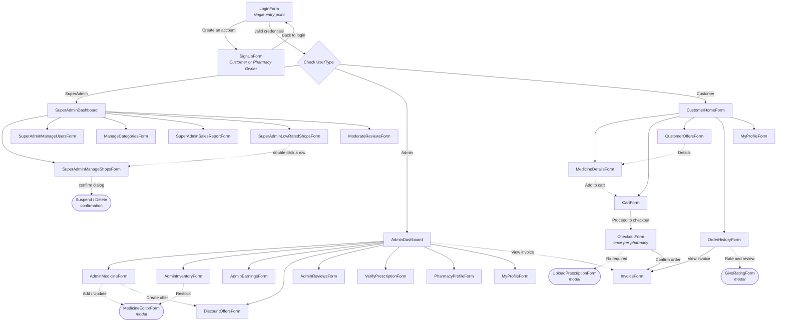

# PharmaLink — Pharmacy Marketplace

> An online pharmacy marketplace that connects patients with licensed neighbourhood pharmacies.
> A C# Windows Forms desktop application over a Microsoft SQL Server database.

**American International University–Bangladesh (AIUB)**
Department of Computer Science, Faculty of Science and Technology
**CSC2210: Object Oriented Programming 2** — Summer 2025–2026, Section R
Supervised by **Dr. Md. Iftekharul Mobin**

| Name | ID |
|------|-----|
| Nafiul Islam | 21-45717-3 |
| Md Arafat Rahman | 22-47910-2 |
| Muhtasim Mahin | 23-53789-3 |
| Shohidur Raza Sujon | 22-49449-3 |

---

## Quick Links

| Artefact | Link |
|----------|------|
| 🎥 **Demo video** | **[Watch the demonstration](REPLACE_WITH_YOUR_VIDEO_LINK)** — see [Section 18](#18-demo-video) for per-member timestamps |
| 📄 **Project report (PDF)** | [`docs/Project_Report.pdf`](docs/Project_Report.pdf) |
| 🗄️ **Database script (SQL)** | [`PharmaLinkDB_Setup.sql`](PharmaLinkDB_Setup.sql) |
| 🖼️ **Screenshots** | [`docs/screenshots/`](docs/screenshots) |
| 📐 **Diagrams** | [`docs/diagrams/`](docs/diagrams) |
| ⚠️ **Report vs code** | [`docs/REPORT-VS-CODE.md`](docs/REPORT-VS-CODE.md) — where the design report and the built app differ |
| ▶️ **How to run** | [Section 13 — Setup and Running](#13-setup-and-running) · [Section 19 — Run Verification](#19-run-verification) |


---

## Table of Contents

1. [Introduction](#1-introduction)
2. [Case Study](#2-case-study)
3. [Functional Requirements](#3-functional-requirements)
4. [User Stories](#4-user-stories)
5. [ER Diagram](#5-er-diagram)
6. [Normalization](#6-normalization)
7. [Database Schema](#7-database-schema)
8. [Database Queries](#8-database-queries)
9. [Transition Table (Navigation)](#9-transition-table-navigation)
10. [Features and Facilities](#10-features-and-facilities)
11. [Tech Stack](#11-tech-stack)
12. [Project Structure](#12-project-structure)
13. [Setup and Running](#13-setup-and-running)
14. [Demonstration Accounts](#14-demonstration-accounts)
15. [Screenshots](#15-screenshots)
16. [Team Contribution](#16-team-contribution)
17. [Conclusion and Future Work](#17-conclusion-and-future-work)
18. [Demo Video](#18-demo-video)
19. [Run Verification](#19-run-verification)

---

## 1. Introduction

In a city where a fever at eleven at night still means a rickshaw ride to whichever pharmacy is open, getting the right medicine quickly is a real problem and not a small one. **PharmaLink** is a desktop application, written in C# with Windows Forms over a Microsoft SQL Server database, that puts a software platform between the two sides of that problem. Licensed pharmacies list what is actually on their shelves, patients search across every listed pharmacy at once, and the company that runs the platform earns a commission on each completed sale.

The system is a **three tier marketplace**. The **Super Admin** is the platform operator, the **Admin** is a pharmacy owner selling through the platform, and the **Customer** is the patient buying. All three are stored in one `Users` table, and a `UserType` column decides which dashboard opens after login.

```
   Customers  (n)                                              Pharmacies  (n)
        │                                                             │
        │   search, filter, cart, pay, rate        list stock, price, │
        └──────────────►  ┌──────────────────────┐  ◄─────────────────┘
                          │      PharmaLink      │
                          │  (IT platform, 3rd   │
                          │   party, takes a     │
                          │   commission)        │
                          └──────────────────────┘
```

PharmaLink owns no medicine. It is the IT company in the middle, as Chaldal sits between grocers and households, or Foodpanda between restaurants and diners.

---

## 2. Case Study

Anyone who has bought medicine at short notice in Dhaka knows the routine. A child spikes a fever at eleven at night, and someone goes out on a rickshaw to Mitford or the nearest para shop to find out whether the medicine is even in stock. If it is not, the search starts again at the next shop, with no way to compare prices and no way to confirm the strip is genuine.

The pharmacy owner has the mirror problem. He keeps stock in a paper register, does not know which item is running out until a customer asks, and cannot reach a buyer four streets away who has never heard of his shop.

Three actors work inside the system and each wants something different:

- **The Super Admin** wants a trustworthy marketplace. He approves every new pharmacy against its DGDA drug licence number, suspends the ones customers rate badly, maintains the master category list, moderates abusive reviews and watches the commission earned.
- **The Admin (pharmacy owner)** wants to sell more without hiring staff. He lists his medicines with price and stock, is warned when an item falls below its minimum level, runs discount offers, and reads an earnings report telling him what he is owed.
- **The Customer** wants the right medicine at a fair price delivered to her door. She searches, filters by category, price range and area, reads what other buyers said, pays by bKash or cash on delivery, and rates the pharmacy afterwards.

**Money flows in one direction and the commission comes out of the middle of it.** The customer pays the full bill at checkout. The order stores the total amount and, beside it, the commission calculated from that pharmacy's own rate — eight percent for most shops and ten for a few. PharmaLink settles the remainder to the owner. Because the commission is *frozen on the order row*, raising prices next month cannot change what a pharmacy owed on last month's sales.

---

## 3. Functional Requirements

The requirements are numbered and grouped by role. Every one of them is answered by a form in the transition table in Section 9 and by at least one statement in Section 8.

### Super Admin

| No. | Requirement |
|-----|-------------|
| 1 | Shall log in with the same login form as every other user and be routed to the Super Admin dashboard when `UserType = 'SuperAdmin'`. |
| 2 | Shall view every pharmacy registration that is in Pending status and approve or reject it after checking the DGDA licence number. |
| 3 | Shall suspend or delete a pharmacy owner, especially one whose average customer rating is poor. |
| 4 | Shall view a list of all Admins and Customers with a keyword search and a status filter. |
| 5 | Shall view a platform wide sales dashboard showing total orders, total revenue and commission earned per pharmacy. |
| 6 | Shall generate a low rated pharmacy report listing every pharmacy whose average rating is below 2.5. |
| 7 | Shall add, edit and deactivate entries in the master medicine category list. |
| 8 | Shall hide abusive or fake reviews without deleting the underlying row. |
| 9 | Shall set the commission rate of an individual pharmacy between 0 and 30 percent. |

### Admin (Pharmacy Owner)

| No. | Requirement |
|-----|-------------|
| 10 | Shall register a pharmacy with a shop name, DGDA licence number, area, address, contact number and logo; the pharmacy stays Pending until the Super Admin approves it. |
| 11 | Shall create, view, update and delete medicines belonging **only to his own pharmacy**, through a DataGridView. |
| 12 | Shall view a stock dashboard showing units sold, units remaining and a low stock alert for every medicine where `Stock < MinStock`. |
| 13 | Shall generate a sales and earnings report showing who bought what, on which date and time, at what unit price, with gross sales, platform commission and net earnings. |
| 14 | Shall create percentage discount offers on his own medicines with a start date and an end date. |
| 15 | Shall read the ratings and reviews written on his own medicines but shall **not** be able to edit or delete them. |
| 16 | Shall verify or reject a prescription image uploaded against an order that contains a prescription only medicine. |
| 17 | Shall update his own profile information and change his own password. |
| 18 | The system shall filter **every** Admin side query by the logged in owner's `PharmacyId` so that no pharmacy can read another pharmacy's data. |

### Customer

| No. | Requirement |
|-----|-------------|
| 19 | Shall sign up with a full name, unique email, unique mobile number, address and password, and shall sign in through the shared login form. |
| 20 | Shall browse medicines listed by every approved pharmacy on one screen. |
| 21 | Shall search medicines by brand name, generic name or manufacturer. |
| 22 | Shall narrow the result set using at least three ComboBox filters: category, price range, area, pharmacy and availability. |
| 23 | Shall open a medicine details screen showing the manufacturer, strength, expiry date, selling pharmacy, prescription requirement and all visible reviews. |
| 24 | Shall add a medicine to the cart, change the quantity of a cart line and remove a cart line. |
| 25 | Shall check out by entering a delivery address and choosing bKash, Nagad, card or cash on delivery, which generates a printable invoice. |
| 26 | Shall upload a photograph of a doctor's prescription when the cart contains a medicine whose `RequiresRx` flag is set. |
| 27 | Shall view a history of past orders with the invoice of each one. |
| 28 | Shall give a rating from 1 to 5 with a written comment, once per medicine per delivered order. |
| 29 | Shall view all discount offers that are active today with the discounted price already calculated. |
| 30 | Shall update her own profile and change her own password. |

### Traceability

No requirement is left without a screen, and no screen is left without a query.

| No. | Form | Query | No. | Form | Query |
|-----|------|-------|-----|------|-------|
| 1 | `LoginForm` | 8.1 | 16 | `VerifyPrescriptionForm` | 8.18 |
| 2 | `SuperAdminManageShopsForm` | 8.11 | 17 | `MyProfileForm` | 8.18 |
| 3 | `SuperAdminManageShopsForm` | 8.11 | 18 | every Admin form | 8.7, 8.8, 8.15 |
| 4 | `SuperAdminManageUsersForm` | 8.16 | 19 | `SignUpForm`, `LoginForm` | 8.14, 8.1 |
| 5 | `SuperAdminSalesReportForm` | 8.7, 8.13 | 20 | `CustomerHomeForm` | 8.2, 8.3 |
| 6 | `SuperAdminLowRatedShopsForm` | 8.10 | 21 | shared search box | 8.4 |
| 7 | `ManageCategoriesForm` | 8.16 | 22 | `CustomerHomeForm` | 8.2, 8.3 |
| 8 | `ModerateReviewsForm` | 8.16 | 23 | `MedicineDetailsForm` | 8.9 |
| 9 | `SuperAdminManageShopsForm` | 8.16 | 24 | `CartForm` | 8.5 |
| 10 | `SignUpForm`, `PharmacyProfileForm` | 8.14 | 25 | `CheckoutForm`, `InvoiceForm` | 8.6 |
| 11 | `AdminMedicineForm`, `MedicineEditorForm` | 8.15 | 26 | `UploadPrescriptionForm` | 8.18 |
| 12 | `AdminInventoryForm` | 8.8 | 27 | `OrderHistoryForm` | 8.17 |
| 13 | `AdminEarningsForm` | 8.7 | 28 | `GiveRatingForm` | 8.17 |
| 14 | `DiscountOffersForm` | 8.15 | 29 | `CustomerOffersForm` | 8.12 |
| 15 | `AdminReviewsForm` | 8.9 | 30 | `MyProfileForm` | 8.18 |

---

## 4. User Stories

Each story is written as *As a role, I can do something, so that business benefit*, followed by the detail of the form, what is validated and what happens in the database.

### Super Admin

**1. As a Super Admin, I can sign in through the same login form as everyone else, so that the platform has one entry point and one place where access is decided.**
There is no separate administrator login. The Super Admin types the same email and password into `LoginForm`, and the login query returns his `UserType` along with his account status. The form reads that value and opens the Super Admin dashboard; the same statement would open a pharmacy dashboard or a customer home for a different `UserType`. An account whose `Status` is Pending or Suspended is refused by the same check, so a suspended administrator cannot get in even with the correct credentials.

**2. As a Super Admin, I can approve or reject a new pharmacy registration, so that only pharmacies with a valid drug licence can sell on the platform.**
A DataGridView lists every pharmacy with its owner, licence number, area and status, and a Status ComboBox filters the grid down to Pending. Selecting a row enables the Approve and Suspend buttons; with no row selected both stay disabled. Approve runs an UPDATE that sets `Pharmacies.Status` to `'Approved'` and `Users.Status` to `'Active'`, after which the owner can log in and the pharmacy's medicines become visible to customers.

**3. As a Super Admin, I can suspend a pharmacy owner, so that a shop with repeated complaints stops receiving new orders.**
A modal confirmation dialog opens showing the pharmacy name and its average rating. On Yes, **three UPDATE statements run inside one transaction**: `Pharmacies.Status` becomes `'Suspended'`, `Users.Status` becomes `'Suspended'`, and every row in `Medicines` belonging to that pharmacy has `IsActive` set to 0. Past orders are never deleted, so the sales history and the invoices customers already hold stay valid.

**4. As a Super Admin, I can search the full user list, so that I can find an account when a customer or an owner contacts support.**
Manage Users shows every Admin and Customer in one grid, with the pharmacy name filled in beside an owner's row through a `LEFT JOIN` on `Pharmacies`. A free text box searches name and email, and a Status ComboBox filters to Pending, Active or Suspended; both are optional, and an empty box means *no filter* rather than *no results*.

**5. As a Super Admin, I can view total revenue and commission per pharmacy, so that I know what the platform has earned and what it owes.**
The Platform Sales Report takes a date range, an area and an order status. Generate runs a query that joins `Pharmacies`, `Orders` and `OrderItems`, groups by pharmacy and returns order count, units sold, gross sales, commission and average item price, with a bold total row appended to the DataGridView. Export CSV writes the same result set to a file so it can be reconciled against bank settlements.

**6. As a Super Admin, I can see which pharmacies are rated below 2.5, so that I can act on poor service before customers leave the platform.**
The Low-Rated Pharmacies form runs a single query that joins `Pharmacies`, `Medicines` and `Reviews`, groups by pharmacy and applies `HAVING AVG(Rating) < 2.5 AND COUNT(ReviewId) >= 2`, so that one angry review cannot condemn a shop. Rows are tinted red. Double clicking a row opens that pharmacy in the Manage Pharmacies form with the record already selected.

**7. As a Super Admin, I can hide an abusive review, so that the review section stays useful without destroying the audit trail.**
The Moderate Reviews form defaults its Rating filter to one and two star reviews, which is where abuse usually sits. The grid shows the reviewer, medicine, pharmacy, comment, date and the order id that proves the purchase. Hide Review sets `Reviews.IsHidden` to 1 rather than deleting the row, so the review disappears from the customer screens and from the average rating calculation but remains available if the pharmacy disputes the decision.

**8. As a Super Admin, I can maintain the master category list, so that every pharmacy classifies its medicines the same way.**
Manage Categories is a DataGridView with Add, Edit and Deactivate. The category name is validated as non empty and protected by a `UNIQUE` constraint, so a second `'Antibiotic'` is rejected with a red error label instead of a database exception. A category already referenced by a medicine cannot be deleted; it can only be deactivated by setting `IsActive` to 0, which keeps existing foreign keys valid.

**9. As a Super Admin, I can change one pharmacy's commission rate, so that I can offer a better rate to a high volume shop without touching anyone else.**
The rate is a column on `Pharmacies` rather than a constant in the code. The value must be between 0 and 30, enforced by the form and again by a `CHECK` constraint. Changing it affects only orders placed from that moment on, because every order stores its own `CommissionAmount` at checkout time.

### Admin (Pharmacy Owner)

**10. As a Pharmacy Owner, I can register my pharmacy and wait for approval, so that customers can trust that every shop on the platform holds a real drug licence.**
The Sign Up form, with *Register as* set to Pharmacy Owner, asks for the shop name, DGDA licence number, area, address and contact number in addition to the personal fields. On save **two rows are written inside one transaction**: a `Users` row with `UserType 'Admin'` and `Status 'Pending'`, and a `Pharmacies` row with `Status 'Pending'` linked to it. The licence number is protected by a `UNIQUE` constraint, so the same licence cannot be registered twice.

**11. As a Pharmacy Owner, I can update my shop profile and my password, so that customers always see my current address and my account stays secure.**
The My Pharmacy Profile form edits the shop name, area, address, contact number and logo, and every UPDATE carries `WHERE PharmacyId = @PharmacyId` so an owner cannot edit another shop. The licence number is displayed read only, because changing it would mean a new licence and a fresh approval.

**12. As a Pharmacy Owner, I can add a new medicine, so that customers can find and buy it from my pharmacy.**
Add Medicine opens a modal dialog asking for medicine name, generic name, category (ComboBox), manufacturer, strength, unit price, stock, minimum stock, expiry date, a prescription required checkbox and a description. Unit price must be a positive number, stock and minimum stock must be zero or more, the expiry date must be in the future and the name cannot be empty; if any rule fails a red error label appears under the field and the Save button stays disabled. On Save a row is inserted into `Medicines` carrying the logged in owner's `PharmacyId`, the same rules are enforced again by `CHECK` constraints in the database, and the DataGridView refreshes immediately.

**13. As a Pharmacy Owner, I can see which of my medicines are running out, so that I can restock before I lose a sale.**
The Stock and Inventory form opens with four summary tiles and a Low Stock Alert panel. The alert grid runs a query filtered by `WHERE PharmacyId = @PharmacyId AND Stock < MinStock`, and it displays the shortfall in units so the owner knows how much to order. Rows in the alert panel are painted with a red background through the `CellFormatting` event. Selecting a row and clicking Restock opens the Edit Medicine dialog with the stock field focused.

**14. As a Pharmacy Owner, I can read my earnings report, so that I can check what PharmaLink owes me after commission.**
The Sales and Earnings form takes a date range and an optional medicine filter. It joins `Orders`, `OrderItems`, `Medicines` and `Users` so that every line shows the order number, date and time, customer name, medicine, quantity, unit price and subtotal. Four tiles above the grid show gross sales, platform commission, net earnings and units sold. Commission is read from `Orders.CommissionAmount`, which was frozen at checkout time, so changing a medicine's price today never rewrites last month's report.

**15. As a Pharmacy Owner, I can create a discount offer, so that I can move stock during a slow season.**
The Discount Offers form lists the owner's existing offers and lets him create a new one by choosing a medicine from a ComboBox, entering a discount percentage and picking a start and end date. The percentage must be greater than 0 and no more than 70, and the end date cannot be earlier than the start date; both rules are enforced in the form and again by `CHECK` constraints on the `Offers` table. Once saved, the discounted price appears automatically on the customer's Offers screen for exactly the dates chosen.

**16. As a Pharmacy Owner, I can read the reviews written about my medicines, so that I can understand what customers complain about.**
The Customer Reviews form is **read only by design**. It shows a DataGridView of reviewer name, medicine, rating, comment and date for medicines belonging to this pharmacy only, with an average rating displayed above the grid. There is no Delete button anywhere on this form. If the owner believes a review is abusive he uses the Report button, which flags it for the Super Admin rather than removing it himself.

**17. As a Pharmacy Owner, I can verify a prescription before dispatch, so that I do not dispense a controlled medicine without a doctor's order.**
When an order contains a medicine whose `RequiresRx` flag is set, the order appears in the Prescriptions queue with the uploaded image and the doctor's name. The owner opens the image, then clicks Approve or Reject, which sets `Prescriptions.VerifyStatus`. An order whose prescription is still Pending cannot be moved to Confirmed, so the Confirm button on that order stays disabled and a hint explains why.

### Customer

**18. As a Customer, I can create an account, so that I can order medicine without visiting a pharmacy in person.**
The Sign Up form asks for account type, full name, email, mobile number, address, password and password confirmation. Email must match a basic address pattern and must not already exist, mobile must be eleven digits and unique, and the two password boxes must match; each failure shows a red label directly under the offending field and keeps the Create Account button disabled. On success a row is inserted into `Users` with `UserType 'Customer'` and `Status 'Active'`.

**19. As a Customer, I can search and filter medicines, so that I can find what I need at a price I can afford.**
The Home screen carries a search TextBox and five ComboBox filters: category, price range, area, pharmacy and availability. Search matches the keyword against medicine name, generic name and manufacturer with a `LIKE` query, so typing *paracetamol* finds Napa and Ace Plus even though neither brand contains that word. Filters are combined in a single query and only medicines belonging to Approved pharmacies are returned. The result count and the number of active filters are shown in the status strip.

**20. As a Customer, I can read reviews before I buy, so that I can avoid a pharmacy that sends damaged goods.**
The Medicine Details screen shows the manufacturer, strength, expiry date, selling pharmacy and whether a prescription is needed, followed by a grid of every visible review with the reviewer's name, star rating, comment and date. The reviews come from a join of `Reviews` and `Users` filtered by `IsHidden = 0`. If a discount offer is running today the original price is struck through and the discounted price is displayed beside it.

**21..As a Customer, I can manage my cart, so that I can change my mind before I pay.
The Cart form shows each line with Medicine, Selling Pharmacy, Unit Price, and a Quantity textbox and subtotal, and has a summary panel that displays Items Total, Discount, Delivery Charge, and Payable Amount. Adding to an existing quantity (if there is some) above the current stock is not allowed, and bringing a quantity to zero removes the line from the display. The `UNIQUE` constraint on `(CustomerId, MedicineId)` ensures that no duplicate rows are inserted into the CustomerMedicines table when a medicine is added to the cart.

**22..As a Customer, I can check out and be issued with an invoice, to give me evidence of what I have paid.
In the Checkout form, the delivery address is pre filled from the profile, and the customer has to select the payment method, upon selecting bKash or Nagad, it shows a mobile number field which should be eleven digits in length, and the Confirm Order button remains disabled until All fields are filled correctly. Confirm runs one transaction, inserting the `Orders` row with its total/commission, inserting one `OrderItems` row for each cart line, at the price it is displayed on screen, decrements the `Medicines.Stock`, and deletes the customer's cart lines from that pharmacy. The Invoice screen is then displayed with a printable bill that includes the Order Number, the two addresses and the line items and grand total.

**23..As a Customer, I can upload my prescription, so that I can purchase an antibiotic which legally requires a prescription.
If the cart has a medicine in it that has been set with RequiresRx, then a modal will open asking for a photo of the prescription and optionally the prescribing doctor's name. Only JPG and PNG files under 2MB will be accepted and no dialog will be displayed when removing or uploading the medicine without removing or uploading the medicine from the cart. The file path is saved as ‘VerifyStatus ‘Pending’' in the file ‘Prescriptions' and the order sits in the pharmacy verify queue prior to dispatch.

**24.As a Customer, I can take a look at my previous orders, so that I can reorder the same medicine and produce a bill if something is incorrect.
Order History displays all orders by date, selling pharmacy, number of line items, total paid, payment method, status pill, where the status is the filter to be applied, the pharmacy is the filter to be applied and the date range is the filter to be applied. View Invoice brings up the printable bill for the selected order. The order was split up in the checkout process, so each of the pharmacies is spread over two lines, with their own invoice, which is the one the customer received.

**25. . A Customer can comment about reliability of a pharmacy after taking delivery of a medicine, so others can know if it is reliable or not.
Rate and Review button is available only for Orders which have status 'Delivered' and not yet been reviewed. It presents a modal containing a one-to-five star ratings selector and a comment box of maximum 500 characters; the Submit button will only be enabled if a rating is selected. The `UNIQUE` constraint prevents the same purchase being rated twice and retrieves the customer id, medicine id and order id when using inserts to insert a row into the table Reviews.

**26.. As a Customer, I can see today's offers, so that I can buy my regular medicine when it is cheapest.**
The Offers screen executes a query, returning only offers that have a `StartDate` that is earlier than today and an `EndDate` that is later than today, where the medicine is in stock, and where the pharmacy is Approved. The following grid contains the offer title, medicine, pharmacy, original price, discount percentage, calculated price that the customer will pay and last valid date. The query filters for Expired offers, as does the form – no stale offers can ever be shown.

**27.. As a Customer, I can change my password, so that my account stays secure. The My Profile form has a Change Password panel asking for the current password, a new password and a confirmation. The new password should be six or more characters long and include at least one numeral, and these two should be the same. To prevent any data from being written, the current pass is first compared to the stored salted SHA-256 hash; if it matches, then only Users are written.PasswordHash and Users.PasswordSalt are updated. No plain text password is kept or recorded.
---

## 5. ER Diagram



<sub>Chen notation, as submitted in [`docs/Project_Report.pdf`](docs/Project_Report.pdf) Section 4. Rectangles are entities, ellipses are attributes with the primary key underlined, diamonds are relationships, and 1 / N / M give the cardinality. A table-level view of the same design is in [`docs/diagrams/from-report/schema-diagram.png`](docs/diagrams/from-report/schema-diagram.png). The Mermaid source below is the same model and renders natively on GitHub.</sub>



**The relationships that make the system worth building.** One user owns exactly one pharmacy, one pharmacy lists many medicines, and one category classifies many medicines. One customer places many orders, and one order contains many medicines while one medicine appears in many orders — that many to many relationship is resolved through the **`OrderItems` junction table**. One customer writes many reviews, and each review points back at the order that proves the purchase was real.

---

## 6. Normalization

Every relationship on the ER diagram is normalised to third normal form. Two representative decompositions are given here; the rest follow the same pattern.

### "Owns" — a one to one relationship

**UNF:** <u>UserId</u>, FullName, Email, PasswordHash, PasswordSalt, Phone, UserAddress, UserType, Status, CreatedAt, <u>PharmacyId</u>, PharmacyName, LicenseNo, Area, PharmacyAddress, ContactPhone, LogoPath, CommissionRate, PharmacyStatus, RegisteredAt

**1NF:** no repeating groups and every attribute is atomic — the relation above is already in 1NF.

**2NF:** the key is `{UserId, PharmacyId}`. `FullName, Email, …` depend on `UserId` alone and `PharmacyName, LicenseNo, …` depend on `PharmacyId` alone, so both are partial dependencies. Decompose:

- **Users**(<u>UserId</u>, FullName, Email, PasswordHash, PasswordSalt, Phone, Address, UserType, Status, CreatedAt)
- **Pharmacies**(<u>PharmacyId</u>, OwnerId (FK), PharmacyName, LicenseNo, Area, Address, ContactPhone, LogoPath, CommissionRate, Status, RegisteredAt)

**3NF:** no non key attribute determines another non key attribute in either relation, so both are already in 3NF. `OwnerId` is declared `UNIQUE`, which is exactly what turns a one to many foreign key into the one to one relationship the diagram claims.

### "Contains" — a many to many relationship

**UNF:** <u>OrderId</u>, CustomerId, PharmacyId, OrderDate, ItemsTotal, DeliveryCharge, CommissionAmount, DeliveryAddress, PaymentMethod, Status, <u>MedicineId</u>, MedicineName, GenericName, Manufacturer, UnitPrice, Quantity

**1NF:** the medicines on one order are a repeating group, so the relation is flattened to one row per (order, medicine) pair, giving the composite key `{OrderId, MedicineId}`.

**2NF:** `OrderDate, ItemsTotal, …` depend on `OrderId` alone; `MedicineName, GenericName, Manufacturer` depend on `MedicineId` alone; only `Quantity` and the price actually charged depend on the whole key. Decompose:

- **Orders**(<u>OrderId</u>, CustomerId (FK), PharmacyId (FK), OrderDate, ItemsTotal, DeliveryCharge, CommissionAmount, DeliveryAddress, PaymentMethod, Status)
- **Medicines**(<u>MedicineId</u>, PharmacyId (FK), CategoryId (FK), MedicineName, GenericName, Manufacturer, Strength, UnitPrice, Stock, MinStock, RequiresRx, ExpiryDate, Description, ImagePath, IsActive)
- **OrderItems**(<u>OrderItemId</u>, OrderId (FK), MedicineId (FK), Quantity, UnitPrice)

**3NF:** `OrderItems.UnitPrice` is deliberately **not** a copy of `Medicines.UnitPrice`; it is the price on the day of purchase, so it depends on the key of `OrderItems` and not transitively on `MedicineId`. That single decision is what lets an old invoice keep resolving after a price change. `Subtotal` is a `COMPUTED PERSISTED` column derived by SQL Server from `Quantity * UnitPrice`, so it can never drift from its own parts. A surrogate `OrderItemId` is used as the primary key and the composite `(OrderId, MedicineId)` is protected by a `UNIQUE` constraint instead, so the 2NF argument still holds exactly.

---

## 7. Database Schema

`PharmaLinkDB` — 10 tables, normalised to third normal form.
PK = primary key, FK = foreign key, U = unique.

### 1. Users
Stores all three roles in one table. The `UserType` column is what the login query reads to decide which dashboard opens.

| Column | Type | Constraint | Description |
|--------|------|-----------|-------------|
| `UserId` | INT IDENTITY(1,1) | **PK** | Surrogate key for every person on the platform |
| `FullName` | NVARCHAR(100) | NOT NULL | Display name on dashboards, invoices and reviews |
| `Email` | NVARCHAR(120) | U, NOT NULL, CHECK | Login identifier; CHECK enforces a basic address pattern |
| `PasswordHash` | NVARCHAR(200) | NOT NULL | Salted SHA-256 hash; plain text is never stored |
| `PasswordSalt` | NVARCHAR(50) | NOT NULL | Per user random salt used when hashing |
| `Phone` | NVARCHAR(20) | U, NOT NULL | Contact number, unique so one number is one account |
| `Address` | NVARCHAR(250) | NULL | Default delivery address, pre filled at checkout |
| `UserType` | NVARCHAR(15) | NOT NULL, CHECK | `'SuperAdmin'`, `'Admin'` or `'Customer'` |
| `Status` | NVARCHAR(15) | NOT NULL, DEFAULT, CHECK | `'Pending'`, `'Active'` or `'Suspended'` |
| `CreatedAt` | DATETIME2(0) | NOT NULL, DEFAULT | Registration timestamp, shown as Member Since |

### 2. Categories
Master list maintained by the Super Admin, kept separate so a category name is stored once.

| Column | Type | Constraint | Description |
|--------|------|-----------|-------------|
| `CategoryId` | INT IDENTITY(1,1) | **PK** | Surrogate key |
| `CategoryName` | NVARCHAR(60) | U, NOT NULL | For example Antibiotic, Painkiller, Diabetes Care |
| `Description` | NVARCHAR(200) | NULL | Short explanation shown in the filter dropdown |
| `IsActive` | BIT | NOT NULL, DEFAULT 1 | Soft delete flag; a referenced category is deactivated, never removed |

### 3. Pharmacies
One row per Admin. `OwnerId` is UNIQUE, which enforces the rule that one pharmacy owner owns exactly one pharmacy.

| Column | Type | Constraint | Description |
|--------|------|-----------|-------------|
| `PharmacyId` | INT IDENTITY(1,1) | **PK** | Every Admin side query filters on this value |
| `OwnerId` | INT | **FK** → Users, U | UNIQUE gives the one to one relationship |
| `PharmacyName` | NVARCHAR(120) | NOT NULL | Trading name, for example Mitford Pharma |
| `LicenseNo` | NVARCHAR(40) | U, NOT NULL | DGDA drug licence checked by the Super Admin |
| `Area` | NVARCHAR(60) | NOT NULL | Locality used by the customer's Area filter |
| `Address` | NVARCHAR(250) | NOT NULL | Full postal address printed on the invoice |
| `ContactPhone` | NVARCHAR(20) | NOT NULL | Shop landline or mobile |
| `LogoPath` | NVARCHAR(250) | NULL | Relative path to the shop logo image |
| `CommissionRate` | DECIMAL(5,2) | NOT NULL, CHECK 0–30 | Platform commission percentage for this pharmacy |
| `Status` | NVARCHAR(15) | NOT NULL, CHECK | `'Pending'`, `'Approved'` or `'Suspended'` |
| `RegisteredAt` | DATETIME2(0) | NOT NULL, DEFAULT | When the registration was submitted |

### 4. Medicines
The products for sale. Two pharmacies selling the same brand are two separate rows with their own price and stock.

| Column | Type | Constraint | Description |
|--------|------|-----------|-------------|
| `MedicineId` | INT IDENTITY(1,1) | **PK** | Surrogate key |
| `PharmacyId` | INT | **FK** → Pharmacies, NOT NULL | The isolation column |
| `CategoryId` | INT | **FK** → Categories, NOT NULL | Classification |
| `MedicineName` | NVARCHAR(120) | NOT NULL | Brand name, for example Napa |
| `GenericName` | NVARCHAR(120) | NOT NULL | Molecule name, for example Paracetamol; searchable |
| `Manufacturer` | NVARCHAR(100) | NOT NULL | For example Beximco, Square, Renata |
| `Strength` | NVARCHAR(40) | NULL | For example 500mg or 100ml |
| `UnitPrice` | DECIMAL(10,2) | NOT NULL, CHECK > 0 | Selling price per unit in taka |
| `Stock` | INT | NOT NULL, CHECK >= 0 | Units currently on the shelf |
| `MinStock` | INT | NOT NULL, DEFAULT 10 | Threshold that triggers the low stock alert |
| `RequiresRx` | BIT | NOT NULL, DEFAULT 0 | 1 means a prescription image is required at checkout |
| `ExpiryDate` | DATE | NOT NULL | Expired stock is not offered to customers |
| `Description` | NVARCHAR(400) | NULL | Short description shown on the details form |
| `ImagePath` | NVARCHAR(250) | NULL | Relative path to the product image |
| `IsActive` | BIT | NOT NULL, DEFAULT 1 | Set to 0 when the pharmacy is suspended or the item is delisted |

Composite `UNIQUE (PharmacyId, MedicineName, Strength)` — one brand and strength per pharmacy.

### 5. Cart
The customer's live basket. One line per medicine, enforced by a UNIQUE constraint so adding twice updates the quantity.

| Column | Type | Constraint | Description |
|--------|------|-----------|-------------|
| `CartId` | INT IDENTITY(1,1) | **PK** | Surrogate key |
| `CustomerId` | INT | **FK** → Users, NOT NULL | Basket owner |
| `MedicineId` | INT | **FK** → Medicines, NOT NULL | What is in the basket |
| `Quantity` | INT | NOT NULL, CHECK > 0 | Units the customer intends to buy |
| `AddedDate` | DATETIME2(0) | NOT NULL, DEFAULT | Used to expire abandoned baskets |
| *(composite)* | UNIQUE | `(CustomerId, MedicineId)` | Stops duplicate lines for the same medicine |

### 6. Orders
One row per completed checkout. A cart spanning two pharmacies becomes two orders.

| Column | Type | Constraint | Description |
|--------|------|-----------|-------------|
| `OrderId` | INT IDENTITY(1001,1) | **PK** | Invoice number shown to the customer |
| `CustomerId` | INT | **FK** → Users, NOT NULL | Who bought |
| `PharmacyId` | INT | **FK** → Pharmacies, NOT NULL | One order per pharmacy |
| `OrderDate` | DATETIME2(0) | NOT NULL, DEFAULT | Timestamp used by every date range report |
| `ItemsTotal` | DECIMAL(12,2) | NOT NULL, CHECK >= 0 | Sum of the line items after any offer discount |
| `DeliveryCharge` | DECIMAL(10,2) | NOT NULL, DEFAULT 60 | Charged to the customer; not commissionable |
| `TotalAmount` | **COMPUTED PERSISTED** | `AS (ItemsTotal + DeliveryCharge)` | The bill total, so it can never disagree with its parts |
| `CommissionAmount` | DECIMAL(12,2) | NOT NULL | `ItemsTotal × CommissionRate`, frozen at checkout |
| `DeliveryAddress` | NVARCHAR(250) | NOT NULL | Copied from the profile but editable per order |
| `PaymentMethod` | NVARCHAR(20) | NOT NULL, CHECK | `'CashOnDelivery'`, `'bKash'`, `'Nagad'` or `'Card'` |
| `Status` | NVARCHAR(15) | NOT NULL, CHECK | `'Placed'`, `'Confirmed'`, `'Delivered'` or `'Cancelled'` |

### 7. OrderItems
**The mandatory junction table.** Resolves the many to many relationship between Orders and Medicines.

| Column | Type | Constraint | Description |
|--------|------|-----------|-------------|
| `OrderItemId` | INT IDENTITY(1,1) | **PK** | Surrogate key |
| `OrderId` | INT | **FK** → Orders ON DELETE CASCADE | Parent order |
| `MedicineId` | INT | **FK** → Medicines, NOT NULL | What was bought |
| `Quantity` | INT | NOT NULL, CHECK > 0 | Units of this medicine on this order |
| `UnitPrice` | DECIMAL(10,2) | NOT NULL, CHECK > 0 | Price on the day of purchase, not today's price |
| `Subtotal` | **COMPUTED PERSISTED** | `AS (Quantity * UnitPrice)` | Derived by SQL Server, so it can never drift |
| *(composite)* | UNIQUE | `(OrderId, MedicineId)` | One line per medicine per order |

### 8. Reviews
Ratings and comments. `OrderId` is carried so the application can prove the reviewer actually bought the item.

| Column | Type | Constraint | Description |
|--------|------|-----------|-------------|
| `ReviewId` | INT IDENTITY(1,1) | **PK** | Surrogate key |
| `CustomerId` | INT | **FK** → Users, NOT NULL | Who wrote it |
| `MedicineId` | INT | **FK** → Medicines, NOT NULL | What is being rated |
| `OrderId` | INT | **FK** → Orders, NOT NULL | Makes the review verified |
| `Rating` | TINYINT | NOT NULL, CHECK 1–5 | Star rating |
| `Comment` | NVARCHAR(500) | NULL | Written feedback |
| `ReviewDate` | DATETIME2(0) | NOT NULL, DEFAULT | When the review was written |
| `IsHidden` | BIT | NOT NULL, DEFAULT 0 | Set to 1 by Super Admin moderation instead of deleting |
| *(composite)* | UNIQUE | `(CustomerId, MedicineId, OrderId)` | One review per medicine per order |

### 9. Offers
Percentage discount on one medicine, valid between two dates, created by the pharmacy owner.

| Column | Type | Constraint | Description |
|--------|------|-----------|-------------|
| `OfferId` | INT IDENTITY(1,1) | **PK** | Surrogate key |
| `MedicineId` | INT | **FK** → Medicines, NOT NULL | What is discounted |
| `OfferTitle` | NVARCHAR(120) | NOT NULL | Shown on the customer's Offers screen |
| `DiscountPercent` | DECIMAL(5,2) | NOT NULL, CHECK 0 < x <= 70 | Discount percentage |
| `StartDate` | DATE | NOT NULL | First day the offer applies |
| `EndDate` | DATE | NOT NULL, CHECK >= StartDate | Last day the offer applies |
| `IsActive` | BIT | NOT NULL, DEFAULT 1 | Lets the owner pause an offer without deleting it |

### 10. Prescriptions
Uploaded prescription image for an order containing a medicine whose `RequiresRx` flag is set.

| Column | Type | Constraint | Description |
|--------|------|-----------|-------------|
| `PrescriptionId` | INT IDENTITY(1,1) | **PK** | Surrogate key |
| `OrderId` | INT | **FK** → Orders ON DELETE CASCADE | Which order it belongs to |
| `CustomerId` | INT | **FK** → Users, NOT NULL | Who uploaded it |
| `ImagePath` | NVARCHAR(250) | NOT NULL | Relative path to the uploaded JPG or PNG |
| `DoctorName` | NVARCHAR(100) | NULL | Prescribing doctor as typed by the customer |
| `UploadedAt` | DATETIME2(0) | NOT NULL, DEFAULT | Upload timestamp |
| `VerifyStatus` | NVARCHAR(15) | NOT NULL, CHECK | `'Pending'`, `'Approved'` or `'Rejected'` by the pharmacy |

The complete runnable script, including sample data, is in **[`PharmaLinkDB_Setup.sql`](PharmaLinkDB_Setup.sql)**.

---

## 8. Database Queries

Every query sits behind a named form and a numbered requirement. In the application every `@parameter` is supplied through `SqlCommand.Parameters` and **nothing is ever concatenated into a query string**, which is what keeps the system safe from SQL injection. `JOIN`, `GROUP BY`, `HAVING` and the aggregates `SUM`, `AVG` and `COUNT` are each used more than once.

### 8.1 Login and role routing
*Form: `LoginForm` — requirement 1*

```sql
SELECT  u.UserId, u.FullName, u.Email, u.PasswordHash, u.PasswordSalt,
        u.Phone, u.Address, u.UserType, u.Status, u.CreatedAt,
        p.PharmacyId, p.PharmacyName, p.Status AS PharmacyStatus
FROM    Users u
        LEFT JOIN Pharmacies p ON p.OwnerId = u.UserId
WHERE   u.Email = @Email;
```

This one query does the whole of authentication. It returns the user id, name, user type and — through a `LEFT JOIN` on `Pharmacies` — the `PharmacyId` when the user happens to be a pharmacy owner. That `PharmacyId` is stored in the session and every later Admin query filters on it. The password itself is verified in memory against the stored salt and hash, so the hash never travels in a `WHERE` clause and a timing difference cannot leak it.

### 8.2 Filter medicines by price range
*Form: `CustomerHomeForm` — requirement 22*

```sql
SELECT  m.MedicineId, m.MedicineName, m.Strength, m.UnitPrice, m.Stock, ph.PharmacyName
FROM    Medicines m
        INNER JOIN Pharmacies ph ON ph.PharmacyId = m.PharmacyId
WHERE   m.IsActive  = 1
  AND   ph.Status   = 'Approved'
  AND   m.UnitPrice BETWEEN @MinPrice AND @MaxPrice
ORDER BY m.UnitPrice ASC;
```

The price range ComboBox supplies `@MinPrice` and `@MaxPrice`. The join to `Pharmacies` is not decoration: it lets the `WHERE` clause exclude any pharmacy that is not Approved, so a suspended shop's stock disappears from the catalogue without a single row being deleted.

### 8.3 Filter by category and availability
*Form: `CustomerHomeForm` — requirement 22*

```sql
SELECT  m.MedicineId, m.MedicineName, c.CategoryName, m.UnitPrice, m.Stock,
        ph.PharmacyName, ph.Area
FROM    Medicines m
        INNER JOIN Categories c  ON c.CategoryId  = m.CategoryId
        INNER JOIN Pharmacies ph ON ph.PharmacyId = m.PharmacyId
WHERE   c.CategoryId = @CategoryId
  AND   m.Stock      > 0
  AND   m.IsActive   = 1
  AND   ph.Status    = 'Approved'
ORDER BY ph.Area, m.MedicineName;
```

Two filters combined in one statement. `Stock > 0` backs the *In stock only* dropdown, and the second join brings in the category name so the grid can show it without a second query. Results are ordered by area so customers see nearby pharmacies grouped together.

### 8.4 Keyword search
*Form: shared search box on the customer home screen — requirement 21*

```sql
SELECT  m.MedicineId, m.MedicineName, m.GenericName, m.Manufacturer,
        m.UnitPrice, m.Stock, ph.PharmacyName
FROM    Medicines m
        INNER JOIN Pharmacies ph ON ph.PharmacyId = m.PharmacyId
WHERE   m.IsActive = 1
  AND  (m.MedicineName LIKE '%' + @Keyword + '%'
    OR  m.GenericName  LIKE '%' + @Keyword + '%'
    OR  m.Manufacturer LIKE '%' + @Keyword + '%')
ORDER BY m.MedicineName;
```

The search deliberately covers three columns. A customer who types *paracetamol* does not know that the brand is called Napa, and a customer who types *Square* wants everything that manufacturer makes. Searching the generic name is what makes the catalogue useful to someone holding a doctor's chit rather than a box.

### 8.5 Cart: add, remove and view with total
*Forms: `MedicineDetailsForm` and `CartForm` — requirement 24*

```sql
-- add an item, or increase the quantity if the line already exists
MERGE Cart AS target
USING (SELECT @CustomerId AS CustomerId, @MedicineId AS MedicineId,
              @Quantity AS Quantity) AS source
    ON  target.CustomerId = source.CustomerId
    AND target.MedicineId = source.MedicineId
WHEN MATCHED THEN
    UPDATE SET target.Quantity = target.Quantity + source.Quantity
WHEN NOT MATCHED THEN
    INSERT (CustomerId, MedicineId, Quantity)
    VALUES (source.CustomerId, source.MedicineId, source.Quantity);

-- change the quantity of one line, or remove it
UPDATE Cart SET Quantity = @Quantity
WHERE  CustomerId = @CustomerId AND MedicineId = @MedicineId;

DELETE FROM Cart
WHERE  CustomerId = @CustomerId AND MedicineId = @MedicineId;

-- view the basket, with today's offer applied to each line
SELECT  ph.PharmacyName, m.MedicineName, ct.Quantity,
        m.UnitPrice                                                   AS ListPrice,
        ISNULL(d.Pct, 0)                                              AS DiscountPercent,
        CAST(m.UnitPrice * (1 - ISNULL(d.Pct,0)/100.0) AS DECIMAL(10,2)) AS PriceYouPay,
        CAST(ct.Quantity * m.UnitPrice * (1 - ISNULL(d.Pct,0)/100.0)
             AS DECIMAL(12,2))                                        AS LineTotal
FROM    Cart ct
        INNER JOIN Medicines  m  ON m.MedicineId  = ct.MedicineId
        INNER JOIN Pharmacies ph ON ph.PharmacyId = m.PharmacyId
        OUTER APPLY (SELECT MAX(o.DiscountPercent) AS Pct
                     FROM   Offers o
                     WHERE  o.MedicineId = m.MedicineId
                       AND  o.IsActive   = 1
                       AND  CAST(GETDATE() AS DATE) BETWEEN o.StartDate AND o.EndDate) d
WHERE   ct.CustomerId = @CustomerId
ORDER BY ph.PharmacyName, m.MedicineName;

-- basket summary per pharmacy: this is how many orders checkout will create
SELECT  ph.PharmacyId, ph.PharmacyName, COUNT(*) AS Lines, SUM(ct.Quantity) AS Units,
        CAST(SUM(ct.Quantity * m.UnitPrice * (1 - ISNULL(d.Pct,0)/100.0))
             AS DECIMAL(12,2)) AS ItemsTotal,
        @DeliveryCharge AS DeliveryCharge, ph.CommissionRate
FROM    Cart ct
        INNER JOIN Medicines  m  ON m.MedicineId  = ct.MedicineId
        INNER JOIN Pharmacies ph ON ph.PharmacyId = m.PharmacyId
        OUTER APPLY (SELECT MAX(o.DiscountPercent) AS Pct FROM Offers o
                     WHERE o.MedicineId = m.MedicineId AND o.IsActive = 1
                       AND CAST(GETDATE() AS DATE) BETWEEN o.StartDate AND o.EndDate) d
WHERE   ct.CustomerId = @CustomerId
GROUP BY ph.PharmacyId, ph.PharmacyName, ph.CommissionRate
ORDER BY ph.PharmacyName;
```

`MERGE` handles the add case in one statement: if the customer already has that medicine in the basket the quantity is increased, otherwise a new line is inserted. That is what keeps the `UNIQUE` constraint on `(CustomerId, MedicineId)` from ever being violated. The view query is offer aware: `OUTER APPLY` finds the best discount running today for each medicine, so the price the customer sees in the cart is the same price the checkout will charge. The second `SELECT` groups the basket by pharmacy, because **a cart that spans two pharmacies becomes two separate orders at checkout** and each one carries its own delivery charge.

### 8.6 Checkout: order, line items and stock in one transaction
*Form: `CheckoutForm` — requirement 25*

```sql
BEGIN TRANSACTION;

    -- 1. what this pharmacy's slice of the basket costs, with today's offers applied
    SELECT @Total = CAST(SUM(ct.Quantity * m.UnitPrice
                             * (1 - ISNULL(d.Pct,0)/100.0)) AS DECIMAL(12,2))
    FROM   Cart ct
           INNER JOIN Medicines m ON m.MedicineId = ct.MedicineId
           OUTER APPLY (SELECT MAX(o.DiscountPercent) AS Pct FROM Offers o
                        WHERE o.MedicineId = m.MedicineId AND o.IsActive = 1
                          AND CAST(GETDATE() AS DATE) BETWEEN o.StartDate AND o.EndDate) d
    WHERE  ct.CustomerId = @CustomerId AND m.PharmacyId = @PharmacyId;

    SELECT @CommRate = CommissionRate FROM Pharmacies WHERE PharmacyId = @PharmacyId;

    -- 2. the order header, with the commission frozen at today's rate
    INSERT INTO Orders (CustomerId, PharmacyId, ItemsTotal, DeliveryCharge,
                        CommissionAmount, DeliveryAddress, PaymentMethod, Status)
    VALUES (@CustomerId, @PharmacyId, @Total, @DeliveryCharge,
            CAST(@Total * @CommRate / 100.0 AS DECIMAL(12,2)),
            @DeliveryAddress, @PaymentMethod, 'Placed');

    SET @NewOrderId = SCOPE_IDENTITY();

    -- 3. one line per cart row, at the discounted price the customer actually saw
    INSERT INTO OrderItems (OrderId, MedicineId, Quantity, UnitPrice)
    SELECT @NewOrderId, ct.MedicineId, ct.Quantity,
           CAST(m.UnitPrice * (1 - ISNULL(d.Pct,0)/100.0) AS DECIMAL(10,2))
    FROM   Cart ct
           INNER JOIN Medicines m ON m.MedicineId = ct.MedicineId
           OUTER APPLY (SELECT MAX(o.DiscountPercent) AS Pct FROM Offers o
                        WHERE o.MedicineId = m.MedicineId AND o.IsActive = 1
                          AND CAST(GETDATE() AS DATE) BETWEEN o.StartDate AND o.EndDate) d
    WHERE  ct.CustomerId = @CustomerId AND m.PharmacyId = @PharmacyId;

    -- 4. take the stock off the shelf
    UPDATE m SET m.Stock = m.Stock - ct.Quantity
    FROM   Medicines m INNER JOIN Cart ct ON ct.MedicineId = m.MedicineId
    WHERE  ct.CustomerId = @CustomerId AND m.PharmacyId = @PharmacyId;

    -- 5. clear only this pharmacy's lines; the rest of the basket becomes the next order
    DELETE ct
    FROM   Cart ct INNER JOIN Medicines m ON m.MedicineId = ct.MedicineId
    WHERE  ct.CustomerId = @CustomerId AND m.PharmacyId = @PharmacyId;

COMMIT TRANSACTION;
```

This is the most important query group in the system. Note the `@PharmacyId` filter on all four cart statements: the customer's basket may hold medicines from two pharmacies, and each pharmacy becomes its own order with its own delivery charge, so checkout runs this batch once per pharmacy in the cart. Five things must then happen together — the order header is written, one line is written per cart row at the price the customer was shown, the stock of every medicine is reduced, that pharmacy's cart lines are cleared, and the commission is frozen on the order row. If any one of them failed on its own, the database would be left with an order that has no items, or stock that was sold twice. **Wrapping them in a single transaction is what makes the checkout safe.** The application also re-checks the stock inside the same transaction before committing, so two customers racing for the last unit of a medicine cannot both win.

### 8.7 Pharmacy earnings (JOIN + GROUP BY + SUM)
*Forms: `SuperAdminSalesReportForm` and `AdminEarningsForm` — requirements 5 and 13*

```sql
SELECT  ph.PharmacyId, ph.PharmacyName, ph.Area,
        COUNT(DISTINCT o.OrderId) AS TotalOrders,
        SUM(oi.Quantity)          AS UnitsSold,
        SUM(oi.Subtotal)          AS GrossSales,
        CAST(SUM(oi.Subtotal) * ph.CommissionRate / 100.0 AS DECIMAL(12,2))
                                  AS PlatformCommission,
        CAST(AVG(oi.UnitPrice) AS DECIMAL(10,2)) AS AverageItemPrice
FROM    Pharmacies ph
        INNER JOIN Orders     o  ON o.PharmacyId = ph.PharmacyId
        INNER JOIN OrderItems oi ON oi.OrderId   = o.OrderId
WHERE   o.Status <> 'Cancelled'
GROUP BY ph.PharmacyId, ph.PharmacyName, ph.Area, ph.CommissionRate
ORDER BY GrossSales DESC;
```

The Super Admin runs this as it stands to see every pharmacy. The pharmacy owner runs **the same query with an added `WHERE ph.PharmacyId = @PharmacyId`** and sees only his own row, which is the clearest possible demonstration of data isolation: one query, two role scopes. Commission is recomputed from the pharmacy rate rather than summed from `Orders`, because the join to `OrderItems` multiplies the order rows and would inflate a plain `SUM` of the header column.

### 8.8 Low stock alert
*Form: `AdminInventoryForm` — requirement 12*

```sql
SELECT  m.MedicineId, m.MedicineName, m.Strength, c.CategoryName,
        m.Stock, m.MinStock, (m.MinStock - m.Stock) AS ShortfallUnits
FROM    Medicines m
        INNER JOIN Categories c ON c.CategoryId = m.CategoryId
WHERE   m.PharmacyId = @PharmacyId      -- data isolation: own pharmacy only
  AND   m.Stock      < m.MinStock
  AND   m.IsActive   = 1
ORDER BY ShortfallUnits DESC;
```

Comparing two columns of the same row is what makes this alert useful. A fixed threshold would be wrong, because ten boxes of a glucometer is plenty while ten strips of Napa is nothing. The shortfall column tells the owner how many units to order. The `WHERE` clause carries the `PharmacyId`, so the alert can never leak another shop's inventory.

### 8.9 Reviews for one medicine (JOIN)
*Forms: `MedicineDetailsForm` and `AdminReviewsForm` — requirements 15 and 23*

```sql
SELECT  r.ReviewId, u.FullName AS ReviewerName, r.Rating, r.Comment, r.ReviewDate
FROM    Reviews r
        INNER JOIN Users     u ON u.UserId     = r.CustomerId
        INNER JOIN Medicines m ON m.MedicineId = r.MedicineId
WHERE   r.MedicineId = @MedicineId
  AND   r.IsHidden   = 0
ORDER BY r.ReviewDate DESC;
```

Reviews store only a `CustomerId`, so the join to `Users` is what turns a number into the reviewer's name on screen. Hidden reviews are excluded here rather than deleted at source, which means Super Admin moderation takes effect immediately on every customer screen while the row survives for audit.

### 8.10 Pharmacies rated below 2.5 (JOIN + GROUP BY + HAVING + AVG)
*Form: `SuperAdminLowRatedShopsForm` — requirement 6*

```sql
SELECT  ph.PharmacyId, ph.PharmacyName, ph.Area,
        u.FullName AS OwnerName, u.Phone AS OwnerPhone,
        COUNT(r.ReviewId) AS TotalReviews,
        CAST(AVG(CAST(r.Rating AS DECIMAL(4,2))) AS DECIMAL(4,2)) AS AverageRating
FROM    Pharmacies ph
        INNER JOIN Users     u ON u.UserId     = ph.OwnerId
        INNER JOIN Medicines m ON m.PharmacyId = ph.PharmacyId
        INNER JOIN Reviews   r ON r.MedicineId = m.MedicineId
WHERE   r.IsHidden = 0
GROUP BY ph.PharmacyId, ph.PharmacyName, ph.Area, u.FullName, u.Phone
HAVING  AVG(CAST(r.Rating AS DECIMAL(4,2))) < 2.5
   AND  COUNT(r.ReviewId) >= 2
ORDER BY AverageRating ASC;
```

Ratings sit on medicines, not on pharmacies, so the average has to be built by joining three tables and grouping back up to the pharmacy. `HAVING` is the right clause rather than `WHERE` because the condition is on the aggregate itself. The second `HAVING` condition, `COUNT(ReviewId) >= 2`, is a deliberate fairness rule: one angry customer should not be enough to put a shop on the suspension list.

### 8.11 Super Admin: approve and suspend a pharmacy owner
*Form: `SuperAdminManageShopsForm` — requirements 2 and 3*

```sql
-- approve a pending pharmacy owner
UPDATE Pharmacies SET Status = 'Approved' WHERE PharmacyId = @PharmacyId;
UPDATE Users      SET Status = 'Active'   WHERE UserId     = @OwnerId;

-- suspend an owner and hide their medicines from customers
UPDATE Pharmacies SET Status   = 'Suspended' WHERE PharmacyId = @PharmacyId;
UPDATE Users      SET Status   = 'Suspended' WHERE UserId     = @OwnerId;
UPDATE Medicines  SET IsActive = 0           WHERE PharmacyId = @PharmacyId;
```

Approval flips two rows, because the pharmacy record and the login account are separate concerns. Suspension flips three: the pharmacy, the account and every medicine that pharmacy lists. **Nothing is deleted anywhere**, so the invoices customers already hold and the sales figures in last month's report stay exactly as they were.

### 8.12 Active offers today with the discounted price
*Form: `CustomerOffersForm` — requirement 29*

```sql
SELECT  o.OfferId, o.OfferTitle, m.MedicineName, m.Strength, ph.PharmacyName,
        m.UnitPrice AS OriginalPrice, o.DiscountPercent,
        CAST(m.UnitPrice * (1 - o.DiscountPercent / 100.0) AS DECIMAL(10,2))
             AS DiscountedPrice,
        o.EndDate
FROM    Offers o
        INNER JOIN Medicines  m  ON m.MedicineId  = o.MedicineId
        INNER JOIN Pharmacies ph ON ph.PharmacyId = m.PharmacyId
WHERE   o.IsActive = 1
  AND   CAST(GETDATE() AS DATE) BETWEEN o.StartDate AND o.EndDate
  AND   m.Stock    > 0
  AND   ph.Status  = 'Approved'
ORDER BY o.DiscountPercent DESC;
```

The discounted price is calculated in the query rather than in C#, so the same number appears on the offers screen, the details screen, the cart and the invoice with no chance of the four disagreeing. Filtering on the date range inside the query means an expired offer can never be shown by mistake, whatever the form does.

### 8.13 Revenue by area (JOIN + GROUP BY + HAVING + COUNT + SUM)
*Form: Super Admin dashboard tiles — requirement 5*

```sql
SELECT  ph.Area,
        COUNT(DISTINCT ph.PharmacyId) AS PharmaciesInArea,
        COUNT(DISTINCT o.OrderId)     AS Orders,
        SUM(o.TotalAmount)            AS Revenue,
        SUM(o.CommissionAmount)       AS CommissionEarned
FROM    Pharmacies ph
        INNER JOIN Orders o ON o.PharmacyId = ph.PharmacyId
WHERE   o.Status = 'Delivered'
GROUP BY ph.Area
HAVING  SUM(o.TotalAmount) > 100
ORDER BY Revenue DESC;
```

A reporting query that answers a question the Super Admin actually asks: which parts of the city are worth expanding into. It groups delivered orders by pharmacy area and uses `HAVING` to drop areas that have not yet crossed a meaningful revenue figure.

### 8.14 Sign up: register a customer or a pharmacy owner
*Form: `SignUpForm` — requirements 10 and 19*

```sql
-- a customer signs up: usable straight away
INSERT INTO Users (FullName, Email, PasswordHash, PasswordSalt, Phone,
                   Address, UserType, Status)
VALUES (@FullName, @Email, @Hash, @Salt, @Phone, @Address, 'Customer', 'Active');

-- a pharmacy owner signs up: the account and the pharmacy both start Pending
INSERT INTO Users (FullName, Email, PasswordHash, PasswordSalt, Phone,
                   Address, UserType, Status)
VALUES (@FullName, @Email, @Hash, @Salt, @Phone, @Address, 'Admin', 'Pending');
SET @NewUserId = SCOPE_IDENTITY();

INSERT INTO Pharmacies (OwnerId, PharmacyName, LicenseNo, Area, Address,
                        ContactPhone, Status)
VALUES (@NewUserId, @PharmacyName, @LicenseNo, @Area, @Address, @ContactPhone, 'Pending');
```

A customer is created Active and can use the platform immediately. A pharmacy owner is created Pending together with a Pending pharmacy row **inside one transaction**, and neither becomes usable until the Super Admin approves it, which is the workflow behind query 8.11. The `UNIQUE` constraints on `Email`, `Phone` and `LicenseNo` are what actually stop a duplicate account; the form checks first only to give a friendly message.

### 8.15 Medicine CRUD for the logged in pharmacy
*Forms: `AdminMedicineForm` and the Add / Edit Medicine dialog — requirements 11 and 14*

```sql
-- CREATE
INSERT INTO Medicines (PharmacyId, CategoryId, MedicineName, GenericName,
                       Manufacturer, Strength, UnitPrice, Stock, MinStock,
                       RequiresRx, ExpiryDate, Description)
VALUES (@PharmacyId, @CategoryId, @MedicineName, @GenericName, @Manufacturer,
        @Strength, @UnitPrice, @Stock, @MinStock, @RequiresRx, @ExpiryDate, @Description);

-- READ (the DataGridView)
SELECT  m.MedicineId, m.MedicineName, m.GenericName, c.CategoryName, m.Manufacturer,
        m.Strength, m.UnitPrice, m.Stock, m.MinStock, m.RequiresRx, m.ExpiryDate
FROM    Medicines m INNER JOIN Categories c ON c.CategoryId = m.CategoryId
WHERE   m.PharmacyId = @PharmacyId AND m.IsActive = 1
ORDER BY m.MedicineName;

-- UPDATE
UPDATE Medicines
SET    UnitPrice = @UnitPrice, Stock = @Stock, MinStock = @MinStock,
       ExpiryDate = @ExpiryDate
WHERE  MedicineId = @MedicineId AND PharmacyId = @PharmacyId;

-- DELETE (soft, so OrderItems rows stay valid)
UPDATE Medicines SET IsActive = 0
WHERE  MedicineId = @MedicineId AND PharmacyId = @PharmacyId;

-- create a discount offer on one of my own medicines  (requirement 14)
INSERT INTO Offers (MedicineId, OfferTitle, DiscountPercent, StartDate, EndDate)
SELECT m.MedicineId, @OfferTitle, @DiscountPercent, @StartDate, @EndDate
FROM   Medicines m
WHERE  m.MedicineId = @MedicineId AND m.PharmacyId = @PharmacyId;  -- own medicines only
```

The statements behind the Add, Update, Delete and Create Offer buttons. **Every one of them carries `PharmacyId`**, so an Admin cannot create a medicine under someone else's shop and cannot update or delete a row that is not his — an UPDATE aimed at another pharmacy's row simply changes nothing. Delete is a soft delete: setting `IsActive` to 0 keeps the foreign keys from `OrderItems` intact, so old invoices still resolve.

### 8.16 Super Admin: user list, category CRUD and commission rate
*Forms: `SuperAdminManageUsersForm`, `ManageCategoriesForm`, `ModerateReviewsForm` — requirements 4, 7, 8 and 9*

```sql
-- all users, with the pharmacy name for owners  (requirement 4)
SELECT  u.UserId, u.FullName, u.Email, u.Phone, u.UserType, u.Status,
        ph.PharmacyName, u.CreatedAt
FROM    Users u
        LEFT JOIN Pharmacies ph ON ph.OwnerId = u.UserId
WHERE  (@Keyword = '' OR u.FullName LIKE '%' + @Keyword + '%'
                      OR u.Email    LIKE '%' + @Keyword + '%')
  AND  (@Status  = '' OR u.Status   = @Status)
ORDER BY u.UserType, u.FullName;

-- category master list  (requirement 7)
INSERT INTO Categories (CategoryName, Description) VALUES (@Name, @Description);
UPDATE Categories SET CategoryName = @Name, Description = @Description
WHERE  CategoryId = @CategoryId;
UPDATE Categories SET IsActive = 0 WHERE CategoryId = @CategoryId;  -- deactivate, never delete

-- set one pharmacy's commission rate  (requirement 9)
UPDATE Pharmacies SET CommissionRate = @Rate WHERE PharmacyId = @PharmacyId;

-- the moderation queue, and hiding an abusive review  (requirement 8)
SELECT  r.ReviewId, u.FullName AS Reviewer, m.MedicineName, ph.PharmacyName,
        r.Rating, r.Comment, r.ReviewDate, r.OrderId
FROM    Reviews r
        INNER JOIN Users      u  ON u.UserId      = r.CustomerId
        INNER JOIN Medicines  m  ON m.MedicineId  = r.MedicineId
        INNER JOIN Pharmacies ph ON ph.PharmacyId = m.PharmacyId
WHERE   r.Rating <= 2 AND r.IsHidden = 0
ORDER BY r.ReviewDate DESC;

UPDATE Reviews SET IsHidden = 1 WHERE ReviewId = @ReviewId;   -- hidden, never deleted
```

The user list joins `Users` to `Pharmacies` so a pharmacy owner's shop name appears beside his name, and it accepts a keyword and a status from the search box and the Status ComboBox — an empty value means *no filter*. Categories are deactivated rather than deleted, because `Medicines` rows point at them.

### 8.17 Customer: place a review, and read the order history
*Forms: `GiveRatingForm` and `OrderHistoryForm` — requirements 27 and 28*

```sql
-- write a review, but only for a delivered order that actually contained the medicine
INSERT INTO Reviews (CustomerId, MedicineId, OrderId, Rating, Comment)
SELECT  @CustomerId, @MedicineId, @OrderId, @Rating, @Comment
WHERE   EXISTS (SELECT 1
                FROM   OrderItems oi
                       INNER JOIN Orders o ON o.OrderId = oi.OrderId
                WHERE  oi.OrderId    = @OrderId
                  AND  oi.MedicineId = @MedicineId
                  AND  o.CustomerId  = @CustomerId
                  AND  o.Status      = 'Delivered');

-- order history with item count and the reviewable flag  (requirement 27)
SELECT  o.OrderId, o.OrderDate, ph.PharmacyName,
        COUNT(oi.OrderItemId) AS Items,
        o.ItemsTotal, o.DeliveryCharge, o.TotalAmount, o.PaymentMethod, o.Status,
        CASE WHEN o.Status = 'Delivered'
              AND EXISTS (SELECT 1 FROM OrderItems x
                          WHERE x.OrderId = o.OrderId
                            AND NOT EXISTS (SELECT 1 FROM Reviews r
                                            WHERE r.OrderId = o.OrderId
                                              AND r.MedicineId = x.MedicineId))
             THEN 1 ELSE 0 END AS CanReview
FROM    Orders o
        INNER JOIN Pharmacies ph ON ph.PharmacyId = o.PharmacyId
        INNER JOIN OrderItems oi ON oi.OrderId    = o.OrderId
WHERE   o.CustomerId = @CustomerId
GROUP BY o.OrderId, o.OrderDate, ph.PharmacyName, o.ItemsTotal,
         o.DeliveryCharge, o.TotalAmount, o.PaymentMethod, o.Status
ORDER BY o.OrderDate DESC;
```

The review `INSERT` is guarded twice. The `WHERE EXISTS` clause proves the customer really bought that medicine on that delivered order, and the `UNIQUE` constraint on `(CustomerId, MedicineId, OrderId)` stops the same purchase being rated twice, so a duplicate attempt fails at the database even if the form is bypassed. The order history query fills the customer's Orders grid, including the invoice total from the computed `TotalAmount` column and the `CanReview` flag the Rate and Review button binds to.

### 8.18 Profile update, password change and prescription verification
*Forms: `MyProfileForm`, `UploadPrescriptionForm` and `VerifyPrescriptionForm` — requirements 16, 17, 26 and 30*

```sql
-- update own profile  (requirements 17, 30)
UPDATE Users SET FullName = @FullName, Phone = @Phone, Address = @Address
WHERE  UserId = @UserId;

-- change own password: succeeds only if the current password hash matches
UPDATE Users SET PasswordHash = @NewHash, PasswordSalt = @NewSalt
WHERE  UserId = @UserId AND PasswordHash = @OldHash;

-- the customer uploads a prescription during checkout  (requirement 26)
INSERT INTO Prescriptions (OrderId, CustomerId, ImagePath, DoctorName)
VALUES (@OrderId, @CustomerId, @ImagePath, @DoctorName);

-- the pharmacy's prescription queue  (requirement 16)
SELECT  p.PrescriptionId, p.OrderId, u.FullName AS Customer, p.DoctorName,
        p.ImagePath, p.VerifyStatus
FROM    Prescriptions p
        INNER JOIN Orders o ON o.OrderId = p.OrderId
        INNER JOIN Users  u ON u.UserId  = p.CustomerId
WHERE   o.PharmacyId = @PharmacyId AND p.VerifyStatus = 'Pending';

UPDATE Prescriptions SET VerifyStatus = 'Approved'
WHERE  PrescriptionId = @PrescriptionId;

-- an order cannot be confirmed while a prescription on it is still Pending
UPDATE Orders SET Status = 'Confirmed'
WHERE  OrderId = @OrderId
  AND  NOT EXISTS (SELECT 1 FROM Prescriptions p
                   WHERE p.OrderId = @OrderId AND p.VerifyStatus <> 'Approved');
```

The password change verifies the current hash **inside the same UPDATE**, so a wrong current password simply updates no rows and the form reports failure without ever having read the stored hash into memory for comparison. The prescription statements are the Admin side of the same story: an order that still has a Pending prescription cannot be moved to Confirmed, which the last statement enforces with a `NOT EXISTS` clause rather than trusting the form to disable a button.

---

## 9. Transition Table (Navigation)

Every form in the application and every transition between them. `LoginForm` is the only entry point, the *Check UserType* decision is the only branching node, and **no arrow ever crosses from one role branch into another**.








<sub>These are the diagrams from [`docs/Project_Report.pdf`](docs/Project_Report.pdf) Section 8. The three branches on one canvas: [`navigation-complete.png`](docs/diagrams/from-report/navigation-complete.png). The Mermaid source below is the same graph.</sub>



*Solid borders are ordinary forms, rounded borders are modal dialogs, and every child form carries a labelled **Back** button that returns to its parent.*

| # | Form | Reached from | Leads to | Purpose |
|---|------|--------------|----------|---------|
| 1 | `LoginForm` | application start | 3 dashboards, `SignUpForm` | The single entry point for all three roles |
| 2 | `SignUpForm` | `LoginForm` | back to `LoginForm` | Registration for customers and pharmacy owners |
| 3 | `SuperAdminDashboard` | login | forms 4–9 | Four tiles, pending queue, low rated panel |
| 4 | `SuperAdminManageShopsForm` | dashboard, form 8 | back | Approve, suspend, delete, set commission |
| 5 | `SuperAdminManageUsersForm` | dashboard | back | Search every Admin and Customer |
| 6 | `ManageCategoriesForm` | dashboard | back | Master category CRUD |
| 7 | `SuperAdminSalesReportForm` | dashboard | back | Platform sales, commission, CSV export |
| 8 | `SuperAdminLowRatedShopsForm` | dashboard | form 4 | `HAVING AVG(Rating) < 2.5` report |
| 9 | `ModerateReviewsForm` | dashboard | back | Hide or restore a review |
| 10 | `AdminDashboard` | login | forms 11–19 | Tiles, order queue, low stock alert |
| 11 | `AdminMedicineForm` | dashboard | forms 12, 15 | Medicine CRUD, own pharmacy only |
| 12 | `MedicineEditorForm` *(modal)* | forms 11, 13 | back | Add / edit with full field validation |
| 13 | `AdminInventoryForm` | dashboard | form 12 | Low stock alert and full inventory |
| 14 | `AdminEarningsForm` | dashboard | back | Who bought what, and what is owed |
| 15 | `DiscountOffersForm` | dashboard, form 11 | back | Create, pause and delete offers |
| 16 | `AdminReviewsForm` | dashboard | back | Read only reviews, with a Report button |
| 17 | `VerifyPrescriptionForm` | dashboard | back | Approve or reject uploaded prescriptions |
| 18 | `PharmacyProfileForm` | dashboard | back | Shop name, area, address, logo |
| 19 | `MyProfileForm` | dashboards 10 and 20 | back | Own details and password change |
| 20 | `CustomerHomeForm` | login | forms 21–25 | Search plus five ComboBox filters |
| 21 | `MedicineDetailsForm` | forms 20, 23 | back | Details, discounted price, reviews |
| 22 | `CartForm` | form 20 | form 26 | Quantity, removal, per pharmacy summary |
| 23 | `CustomerOffersForm` | form 20 | form 21 | Offers running today |
| 24 | `OrderHistoryForm` | form 20 | forms 27, 28 | Past orders and invoices |
| 25 | `MyProfileForm` | form 20 | back | Own details and password change |
| 26 | `CheckoutForm` | form 22 | forms 27, 29 | Runs once per pharmacy in the cart |
| 27 | `InvoiceForm` | forms 10, 24, 26 | back | Printable bill |
| 28 | `GiveRatingForm` *(modal)* | form 24 | back | Star rating and comment |
| 29 | `UploadPrescriptionForm` *(modal)* | form 26 | back | JPG / PNG under 2 MB |

---

## 10. Features and Facilities

1. **One login for three roles.** Every user signs in through the same form. The login query returns the `UserType`, and that single value decides whether the Super Admin dashboard, the pharmacy owner dashboard or the customer home screen opens. There is no separate administrator entry point to protect.

2. **Licence checked pharmacy onboarding.** A pharmacy owner who registers stays in Pending status, and none of his medicines are visible to customers, until the Super Admin has checked the DGDA drug licence number and approved him.

3. **Data isolation between pharmacies.** Every query on an Admin form carries `WHERE PharmacyId = @PharmacyId`, taken from the session at login. One pharmacy owner can never read another owner's medicines, orders or earnings, and the rule is enforced in the query rather than by hiding controls in the interface.

4. **Search and five way filtering.** Customers search by brand name, generic name or manufacturer, so a doctor's chit that says *paracetamol* finds Napa. Results are narrowed by category, price range, area, pharmacy and availability, all through ComboBox controls rather than free text.

5. **Low stock alerts.** Each medicine carries its own minimum stock level, so the alert compares two columns of the same row instead of using a fixed threshold. Ten boxes of a glucometer is plenty; ten strips of a painkiller is nothing. The alert shows the shortfall in units so the owner knows how much to order.

6. **Prescription control.** A medicine flagged as prescription only cannot be checked out until the customer uploads a photograph of the doctor's prescription, and the order cannot be confirmed until the pharmacy has verified that image.

7. **Time limited discount offers.** A pharmacy owner sets a percentage discount with a start and an end date. The discounted price is calculated inside the query, so the same figure appears on the offers screen, the details screen, the cart and the invoice with no chance of the four disagreeing.

8. **Transactional checkout.** Writing the order, writing its line items, reducing stock and clearing the cart all happen inside one transaction, scoped to one pharmacy. A basket spanning two pharmacies becomes two orders, each with its own delivery charge and its own invoice.

9. **Verified reviews and moderation.** A review points back at the order it came from, so only a customer who actually received the medicine can rate it, and only once per purchase. The Super Admin can hide an abusive review but never delete it, so the rating history stays complete.

10. **Commission frozen at the point of sale.** The commission is calculated once at checkout from the pharmacy's own rate and stored on the order row. A price change next month cannot rewrite what was owed on last month's sales, and the earnings report never has to be reconciled by hand.

11. **Printable invoices and order history.** Every completed order produces a printable bill carrying both addresses, the pharmacy licence number, the line items at the price charged, and the grand total. Customers can reopen any past invoice from their order history.

12. **Passwords never stored in plain text.** Passwords are salted and hashed with SHA-256 before they reach the database, and a password change verifies the current hash inside the same `UPDATE`, so a wrong entry simply updates no rows.

---

## 11. Tech Stack

| Layer | Technology |
|-------|-----------|
| Language | C# 12 |
| UI framework | Windows Forms (.NET 10, `net10.0-windows`) |
| Database | Microsoft SQL Server 2019 or newer (LocalDB / Express both work) |
| Data access | ADO.NET via `Microsoft.Data.SqlClient` 7.0.1 — **parameterised commands only** |
| Configuration | `System.Configuration.ConfigurationManager` (`App.config`) |
| Security | `System.Security.Cryptography.SHA256` with a per user random salt |
| Reporting | `System.Drawing.Printing.PrintDocument` for invoices, CSV export for reports |
| IDE | Visual Studio 2022 / 2026 |

---

## 12. Project Structure

```
PharmaLink-Pharmacy-Marketplace/
│
├── PharmaLinkApp.csproj          # net10.0-windows, WinForms, Microsoft.Data.SqlClient
├── PharmaLinkApp.slnx            # solution file
├── App.config                    # connection string + delivery charge + upload folder
├── Program.cs                    # entry point → LoginForm
├── UserSession.cs                # UserId, UserType and PharmacyId for the whole session
├── PharmaLinkDB_Setup.sql        # complete schema + constraints + sample data
├── README.md                     # this report
│
├── Database/
│   └── DbHelper.cs               # the only class that knows how to reach SQL Server
│
├── Models/
│   ├── User.cs          Pharmacy.cs      Category.cs
│   ├── Medicine.cs      CartLine.cs      Order.cs
│   ├── OrderItem.cs     Review.cs        Offer.cs
│   └── Prescription.cs
│
├── Helpers/
│   ├── PasswordHelper.cs         # salted SHA-256 hash / verify
│   ├── Validator.cs              # every validation rule in one place
│   └── UiTheme.cs                # one palette and one set of control styles
│
├── Services/                     # the repository layer — all SQL lives here
│   ├── AuthService.cs            # login, sign up, profile, password
│   ├── PharmacyService.cs        # approve, suspend, commission rate, shop profile
│   ├── CategoryService.cs        # master category CRUD
│   ├── MedicineService.cs        # catalogue search + owner CRUD + stock
│   ├── CartService.cs            # MERGE add, quantity, per pharmacy grouping
│   ├── OrderService.cs           # the transactional checkout, history, status
│   ├── ReviewService.cs          # verified reviews and moderation
│   ├── OfferService.cs           # time limited discounts
│   ├── PrescriptionService.cs    # image upload and verification
│   └── ReportService.cs          # earnings, low rated, revenue by area, CSV
│
└── Forms/                        # 28 forms, each with its .Designer.cs and .resx
    ├── LoginForm / SignUpForm                                   (shared entry)
    ├── SuperAdminDashboard / SuperAdminManageShopsForm
    │   SuperAdminManageUsersForm / SuperAdminSalesReportForm
    │   SuperAdminLowRatedShopsForm / ManageCategoriesForm
    │   ModerateReviewsForm                                      (Super Admin)
    ├── AdminDashboard / AdminMedicineForm / MedicineEditorForm
    │   AdminInventoryForm / AdminEarningsForm / DiscountOffersForm
    │   AdminReviewsForm / VerifyPrescriptionForm
    │   PharmacyProfileForm                                      (Pharmacy Owner)
    └── CustomerHomeForm / MedicineDetailsForm / CartForm
        CheckoutForm / InvoiceForm / UploadPrescriptionForm
        OrderHistoryForm / GiveRatingForm / CustomerOffersForm
        MyProfileForm                                            (Customer)
```

**Why the layers are split this way.** `Forms` never contains SQL; it calls a service. `Services` never contains a `MessageBox`; it returns data or a boolean plus a message. `DbHelper` is the only class that knows the connection string. That separation is what makes the data isolation rule checkable: to prove that a pharmacy owner cannot read another shop's data you only have to read `MedicineService`, `OrderService` and `ReportService`, not twenty-eight button click handlers.

---

## 13. Setup and Running

### Requirements

- Windows 10 or 11
- Visual Studio 2022 (17.8+) or Visual Studio 2026 with the **.NET desktop development** workload
- The **.NET 10 SDK**
- Microsoft SQL Server (Express, Developer or LocalDB) and SQL Server Management Studio

### Step 1 — Create the database

Open **`PharmaLinkDB_Setup.sql`** in SQL Server Management Studio and press **Execute**. The script:

1. creates the `PharmaLinkDB` database,
2. drops the ten tables in foreign key order so it is safe to re-run,
3. creates all ten tables with every primary key, foreign key, `UNIQUE` and `CHECK` constraint,
4. creates the supporting indexes,
5. inserts sample data — 1 Super Admin, 4 pharmacy owners, 4 customers, 10 categories, 24 medicines, 7 orders with 11 line items, 7 reviews, 4 offers, 1 pending prescription and a 2 line cart,
6. prints a row count per table so you can see it worked.

### Step 2 — Point the application at your server

Edit **`App.config`** if your server is not the default local instance:

```xml
<connectionStrings>
  <add name="db"
       connectionString="Server=.;Database=PharmaLinkDB;Trusted_Connection=True;TrustServerCertificate=True;"
       providerName="Microsoft.Data.SqlClient"/>
</connectionStrings>
```

| Your setup | Value for `Server=` |
|-----------|---------------------|
| Default local instance | `.` or `localhost` |
| SQL Server Express | `.\SQLEXPRESS` |
| LocalDB | `(localdb)\MSSQLLocalDB` |
| Named instance | `MACHINE\INSTANCE` |

SQL authentication instead of Windows authentication:

```
Server=.;Database=PharmaLinkDB;User Id=sa;Password=YourPassword;TrustServerCertificate=True;
```

Two other settings live in `App.config`:

```xml
<appSettings>
  <add key="PrescriptionFolder" value="Uploads\Prescriptions" />
  <add key="DeliveryCharge" value="60" />
</appSettings>
```

### Step 3 — Build and run

```bash
git clone https://github.com/<your-username>/PharmaLink-Pharmacy-Marketplace.git
cd PharmaLink-Pharmacy-Marketplace
dotnet restore
dotnet run
```

Or open `PharmaLinkApp.slnx` in Visual Studio and press **F5**.

### Troubleshooting

| Symptom | Cause and fix |
|--------|----------------|
| *"Could not reach the database. Run PharmaLinkDB_Setup.sql first."* on the login screen | The script has not been run, or `Server=` in `App.config` does not match your instance. |
| *A network-related or instance-specific error occurred* | Wrong instance name, or the SQL Server service is stopped. Start it from `services.msc`. |
| *Login failed for user* | Windows authentication is off on that server; switch the connection string to `User Id` / `Password`. |
| *"This account is still waiting for Super Admin approval."* | You logged in as `imran@newlifepharmacy.com`, which is deliberately left Pending. Approve New Life Pharmacy as the Super Admin first — this is feature 2 working as designed. |
| The prescription image does not display on the verify screen | The seeded row points at a sample path that has no file. Place a real order with an Rx medicine to upload a genuine image. |

---

## 14. Demonstration Accounts

All of these are created by `PharmaLinkDB_Setup.sql` with a real salted SHA-256 hash, so they work immediately.

| Role | Email | Password | Notes |
|------|-------|----------|-------|
| Super Admin | `admin@pharmalink.com.bd` | `Admin@123` | Full platform control |
| Pharmacy Owner | `kamrul@mitfordpharma.com` | `Pharma@123` | Mitford Pharma, 8% commission |
| Pharmacy Owner | `shirin@dhanmondimedico.com` | `Pharma@123` | Dhanmondi Medico, 10% commission, **rated below 2.5** |
| Pharmacy Owner | `tanvir@lazzcare.com` | `Pharma@123` | Lazz Care Pharmacy, has a pending prescription to verify |
| Pharmacy Owner | `imran@newlifepharmacy.com` | `Pharma@123` | New Life Pharmacy — **Pending, cannot log in until approved** |
| Customer | `rahim@gmail.com` | `Cust@123` | Has order history and a live 2 pharmacy cart |
| Customer | `nusrat@gmail.com` | `Cust@123` | |
| Customer | `tanjila@gmail.com` | `Cust@123` | |
| Customer | `sabbir@gmail.com` | `Cust@123` | Has the order with the pending prescription |

### A five minute demonstration path

1. Log in as **`rahim@gmail.com`**. His cart already holds items from two pharmacies — open **My Cart** and read the summary panel, which says the checkout will create two orders.
2. **Proceed to checkout.** The heading reads *Order 1 of 2*. Choose bKash, leave the number incomplete, and watch Confirm Order stay disabled. Complete it and confirm; the invoice opens, and then the form moves to *Order 2 of 2*.
3. Open **My Orders**, reopen an invoice, and use **Rate and review** on a delivered order.
4. Log out and log in as **`kamrul@mitfordpharma.com`**. The dashboard shows the order that just arrived and a low stock alert. Open **My Medicines**, try to save a medicine with a negative price, and read the error that names the `CHECK` constraint.
5. Log out and log in as **`admin@pharmalink.com.bd`**. Approve **New Life Pharmacy**, open **Low Rated Pharmacies** to see Dhanmondi Medico, then **Moderate Reviews** and hide the one star insult.

---

## 15. Screenshots

All captures live in [`docs/screenshots/`](docs/screenshots) and are taken against the sample data created by `PharmaLinkDB_Setup.sql`. The file names below are the ones [`docs/screenshots/README.md`](docs/screenshots/README.md) lists what each one must show.

### Shared entry

| Screen | Image |
|--------|-------|
| Login, with inline validation |  |
| Sign up as a pharmacy owner |  |

### Super Admin

| Screen | Image |
|--------|-------|
| Dashboard — tiles, pending queue, low-rated panel |  |
| Manage Pharmacies — approve, suspend, commission rate |  |
| Platform sales report with CSV export |  |
| Moderate Reviews — hide, never delete |  |
| Low-Rated Pharmacies — `HAVING AVG(Rating) < 2.5` |  |
| Manage Categories — master list CRUD |  |

### Pharmacy Owner (Admin)

| Screen | Image |
|--------|-------|
| Dashboard — order queue and low-stock alert |  |
| My Medicines — CRUD scoped to one pharmacy |  |
| Add Medicine — validation refusing a negative price |  |
| Stock and Inventory — shortfall in units, rows tinted red |  |
| Sales and Earnings — gross, commission, net |  |
| Discount Offers — time-limited percentage discount |  |
| Verify Prescription — approve an uploaded image |  |

### Customer

| Screen | Image |
|--------|-------|
| Home — search plus five ComboBox filters |  |
| Medicine details — offer price and verified reviews |  |
| Cart — a basket spanning two pharmacies |  |
| Checkout — order 1 of 2, bKash number validation |  |
| Printable invoice |  |
| Order history with status pills |  |
| Rate and Review — delivered orders only |  |
| Offers running today |  |
| My Profile and password change |  |


---

## 16. Team Contribution

| Name | ID | Contribution |
|------|-----|--------------|
| Nafiul Islam | 21-45717-3 | Case study, functional requirements, user stories, README assembly |
| Md Arafat Rahman | 22-47910-2 | Database design, normalization, SQL schema diagram, schema.sql, feature queries |
| Muhtasim Mahin | 23-53789-3 | UI navigation diagram, ER diagram, form designs (Super Admin and Admin) |
| Shohidur Raza Sujon | 22-49449-3 | Form designs (Customer), report compilation, proofreading |

---

## 17. Conclusion and Future Work

PharmaLink began as an ordinary observation about buying medicine late at night in Dhaka and ended as a working three tier marketplace. The finished system covers a case study grounded in a real domain, thirty functional requirements traced to a form and a query each, a navigation diagram in which every form is reachable and every form has a way back, a ten table database normalised to third normal form with a mandatory junction table for order line items, and a runnable SQL script whose queries sit behind named features rather than existing for their own sake.

The three artefacts agree with each other, and that was the hardest part of the work. Every form in the navigation diagram that reads or writes data has at least one statement behind it in the script, the traceability table maps each of the thirty requirements to its form and its query, and every query touches only tables and columns that exist in the schema. Where the report claims that a pharmacy owner cannot see another pharmacy's data, the claim is backed by a specific clause, `WHERE PharmacyId = @PharmacyId`, that appears in the queries themselves. Where it claims a customer cannot review the same purchase twice, the claim is backed by a `UNIQUE` constraint on three columns.

What the group takes away is that **the design decides how hard the coding will be**. Choosing a junction table early meant the checkout code stayed simple. Storing the commission on the order row meant the earnings report never has to be reconciled by hand. Keeping the category list in its own table meant a rename is one `UPDATE` instead of a hundred. Passing the `PharmacyId` into the repository from the session, rather than into each method, meant the data isolation rule became impossible to forget.

### Future Work

- A **delivery rider role** with live order tracking.
- **SMS notification** when an order status changes.
- A **refill reminder** for patients on long term medication.
- A real **bKash payment gateway integration** instead of a manually entered number.
- A **Bangla language toggle** for the customer screens.
- Moving from ADO.NET to **Entity Framework Core** so the repository layer shrinks further.

---

## 18. Demo Video

**Video link:** REPLACE_WITH_YOUR_VIDEO_LINK

The recording is narrated in our own voices. Each member records and speaks over the part of the project they worked on, matching the contribution table in [Section 16](#16-team-contribution), and the timestamps below are the marker the examiner uses to find that member's segment.

| # | Segment | Member | Start | End |
|---|---------|--------|-------|-----|
| 0 | Introduction, case study, functional requirements and user stories | Nafiul Islam | 00:00 | |
| 1 | Database: schema, normalization to third normal form, one JOIN / GROUP BY query explained live | Md Arafat Rahman | | |
| 2 | ER and navigation diagrams; Super Admin and Admin screens | Muhtasim Mahin | | |
| 3 | Customer screens: search and filter, cart across two pharmacies, checkout, invoice, rating | Shohidur Raza Sujon | | |
| 4 | Data isolation demonstrated: log in as a second owner, show the other shop's data is unreachable | *(fill in)* | | |

> **Before recording, fill in the two `REPLACE_WITH_YOUR_VIDEO_LINK` placeholders** — one here and one in [Quick Links](#quick-links) — and complete the start and end columns above. The viva announcement asks for a link with your own voice and your individual timestamp, so an unfilled table is a failed check.

### Features to demonstrate on camera

The announcement names these explicitly. Each one maps to a screen and a query in this README:

| Required feature | Where to show it | Query |
|---|---|---|
| Login | `LoginForm`, all three roles from one form | [8.1](#81-login-and-role-routing) |
| CRUD | `AdminMedicineForm` + `MedicineEditorForm` | [8.15](#815-medicine-crud-for-the-logged-in-pharmacy) |
| Search | Keyword box on `CustomerHomeForm` (brand, generic, manufacturer) | [8.4](#84-keyword-search) |
| Filters | Five ComboBoxes on `CustomerHomeForm` | [8.2](#82-filter-medicines-by-price-range), [8.3](#83-filter-by-category-and-availability) |
| Validation | Negative price in Add Medicine; incomplete bKash number at checkout | form rules + `CHECK` constraints |
| Cart / Checkout / Invoice | `CartForm` → `CheckoutForm` → `InvoiceForm` | [8.5](#85-cart-add-remove-and-view-with-total), [8.6](#86-checkout-order-line-items-and-stock-in-one-transaction) |
| Reports | `AdminEarningsForm`, `SuperAdminSalesReportForm`, `SuperAdminLowRatedShopsForm` | [8.7](#87-pharmacy-earnings-join--group-by--sum), [8.10](#810-pharmacies-rated-below-25-join--group-by--having--avg), [8.13](#813-revenue-by-area-join--group-by--having--count--sum) |
| Low-stock handling | `AdminInventoryForm`, `Stock < MinStock` with shortfall in units | [8.8](#88-low-stock-alert) |
| Data isolation | Same query, two role scopes — every Admin statement carries `WHERE PharmacyId = @PharmacyId` | [8.7](#87-pharmacy-earnings-join--group-by--sum), [8.8](#88-low-stock-alert), [8.15](#815-medicine-crud-for-the-logged-in-pharmacy) |

---

## 19. Run Verification

Everything an examiner needs to get the project running on a fresh machine, in one place.

### Database engine

Microsoft SQL Server 2019 or newer. SQL Server Express, Developer Edition and LocalDB all work unchanged. The database is named **`PharmaLinkDB`** and is created in full — schema, constraints, indexes and sample data — by [`PharmaLinkDB_Setup.sql`](PharmaLinkDB_Setup.sql). The script drops the ten tables in foreign key order before recreating them, so it is safe to run more than once.

### Connection string — file and line

There is exactly one connection string in the solution and exactly one class that reads it.

| What | File | Line |
|------|------|------|
| The connection string itself | [`App.config`](App.config) | **4–6** |
| The only code that reads it | [`Database/DbHelper.cs`](Database/DbHelper.cs) | **18–19** |
| Where the `SqlConnection` is built | [`Database/DbHelper.cs`](Database/DbHelper.cs) | **21–24** |
| Prescription upload folder | [`App.config`](App.config) | 10 |
| Flat delivery charge (BDT 60) | [`App.config`](App.config) | 12 |

`App.config`, lines 3–7:

```xml
<connectionStrings>
  <add name="db"
       connectionString="Server=.;Database=PharmaLinkDB;Trusted_Connection=True;TrustServerCertificate=True;"
       providerName="Microsoft.Data.SqlClient"/>
</connectionStrings>
```

`Database/DbHelper.cs`, lines 18–24:

```csharp
private readonly string _connectionString =
    ConfigurationManager.ConnectionStrings["db"].ConnectionString;

public SqlConnection GetConnection()
{
    return new SqlConnection(_connectionString);
}
```

No other file contains a server name, a database name or a password, so changing `App.config` line 5 is the only edit needed to move the application to a different instance.

### Required configuration changes

| Your SQL Server setup | Value for `Server=` |
|-----------------------|---------------------|
| Default local instance | `.` or `localhost` |
| SQL Server Express | `.\SQLEXPRESS` |
| LocalDB | `(localdb)\MSSQLLocalDB` |
| Named instance elsewhere | `MACHINE\INSTANCE` |

If Windows authentication is unavailable, replace `Trusted_Connection=True` with `User Id=sa;Password=YourPassword`.

### Test credentials

| Role | Email | Password |
|------|-------|----------|
| Super Admin | `admin@pharmalink.com.bd` | `Admin@123` |
| Shop Owner (Admin) | `kamrul@mitfordpharma.com` | `Pharma@123` |
| Customer | `rahim@gmail.com` | `Cust@123` |

Full list, including the deliberately-Pending owner and the low-rated shop, is in [Section 14](#14-demonstration-accounts).

### Project facts at a glance

| Item | Count |
|------|-------|
| Windows Forms | 28 |
| Database tables | 10 |
| Foreign keys / `UNIQUE` / `CHECK` constraints | 15 / 13 / 20 |
| Indexes | 12 |
| Service classes (all SQL lives here) | 10 |
| Model classes | 10 |
| Hand-written C# (excluding `.Designer.cs`) | ~10,500 lines |
| Target framework | `net10.0-windows` |

---

## License

Academic project submitted for CSC2210 (Object Oriented Programming 2) at American International University–Bangladesh. Free to read and learn from.
